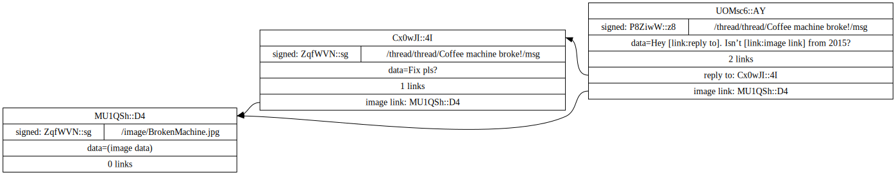

# Why

These are exciting times. 
More than 232 people have digitally connected, and how we network is due an upgrade. 

## The internet of streams

The digital world you know is built on structuring streams of data.
At its core the internet[^2] attempts to provide a model where: 

For any two connected devices running any application, there exists a connection to transmit data.

[^2]: TCP/IP. I'll be loose on definitions and oversimplify a lot - even use 'internet' instead of 'web'. I don't expect readers to know or care for the details. But if you find a false statement shoot me a message.

To do this it uses the following types of packets to transmit data between two devices.

:::{.container}
+-----------------+-----------------------+-----------------------------------------------------------------+
|                 | Field                 | Purpose                                                         |
+=================+=======================+=================================================================+
| Internet Packet | IP ADDRESS            | Address for a device                                            |
+                 +-----------------------+-----------------------------------------------------------------+
|                 | PORT                  | A number to address an application on a device                  |
+                 +-----------------------+-----------------------------------------------------------------+
|                 | SEQUENCE ID           | A number to (re)order packets when they arrive out of order     |
+                 +-----------------------+-----------------------------------------------------------------+
|                 | DATA                  | Set by application                                              |
+-----------------+-----------------------+-----------------------------------------------------------------+
:::

Packets are transmitted and - using the `IP address` - they reach their destination; a device such as the one you're using right now.
On the device an application is running that waits for packets with a specific `port` to arrive.

In transit, a packet can get lost or corrupted.
The result is that packets don't arrive in the order they were sent.
By adding a sequence number, the destination can verify all packets have arrived and reorder them to the order they were sent in.

I imagine the proto-internet was first discovered when people realized that packet SEQUENCE IDs are essential complexity.
When transmitting data, something must define the order of packets.
As a consequence, the physical route each packet takes is irrelevant.

The result is that _conceptually_ each application on each device can talk to any other application on any other device.

This model is ideal for phone-calls or video streams.
To build more interesting applications we create protocols to add further structure to the stream of data.
There are thousands of different protocols, but what most of them have in common is a way to transmit questions and answers.

A couple of well known variants that have this property are:

| System | Question                      | Answer              |
|--------+-------------------------------+---------------------|
| DNS    | archive.org                   | 207.241.224.2       |
| HTTP   | /forum/index.html             | Hello world!        |
| FTP    | /Projects/linkspace/readme.md | In a supernet [...] |
| SQL    | SELECT * from MSG where ID=1; | A message in a db   |

At first we used these tools to create websites to provide information.
But this has grown into interactive 'platforms'.
Services that store, forward, and administrate information such that multiple devices, and thus people, can communicate.

One reason for building linkspace is this: 

<b>We have reached the limit of using this model of streaming questions/answers paradigm for multi-party communication.</b>

First, the stream abstraction can leak.
Streams get disconnected, one side is overloaded or errors, etc.

Then, when more than two devices are involved the leaks compound.
Synchronization is as slow as the slowest link, answers become stale or bad, and assumptions that an application relies on are no longer true.

Alternatively you built a supernet.

:::{.definition}
Supernet  [ˈsü-pərˌnet] 
A self-referential multi-participant data organization protocol whose primary
addressing method uses hashes instead of endpoint identifiers.

e.g. git, bitcoin, linkspace
:::

Once you start thinking in terms of supernets, it becomes clear that many problems with streaming questions/answers are accidental complexity. Using a supernet to build an application those problems become irrelevant or trivial[^trivial] - and we can do things that are practically impossible if we keep talking streams.

[^trivial]: Trivial is perhaps overstating it, but take for example a stream getting disconnected - A supernet with a good API should guide a developer to take the most extreme cases of asynchronicity into account. i.e. slow or disconnected server should not break a system. Well designed supernet applications can be offline-first and without any critically important nodes or line of communication.

## Linkspace

Linkspace attempts to provide a model where: for any group running any application, there exists a space to address data[^idea].

[^idea]: This idea and other ideas used in linkspace aren't new. But I believe linkspace is a simple synthesis compared to previous attempts (see [alts](#alts)).

If the current internet is streams for key-value systems, so you can talk _to_ server, 
then linkspace is a shared key-value space, so groups can talk _about_ data.

A unit in linkspace is called a **point**. Each point has data, some auxiliary fields, and is uniquely identified by its hash.

To understand what each field does lets start with a simple example of a message forum. 

:::{.container .pkt .pd}
+-----------------------------------+----------------------------------+
| /image/BrokenMachine.jpg          | (image data)                     |
+-----------------------------------+----------------------------------+
| /thread/Coffee machine broke!/msg | Fix pls? image/BrokenMachine.jpg |
+-----------------------------------+----------------------------------+
:::

+

:::{.container .pkt .pd}
+-----------------------------------+----------------------------------+
| /thread/Can we use Rust?/msg      | I heard it is great.             |
+-----------------------------------+----------------------------------+
:::

=

:::{.container .pkt .pd}
+-----------------------------------+----------------------------------+
| /image/BrokenMachine.jpg          | (image data)                     |
+-----------------------------------+----------------------------------+
| /thread/Can we use Rust?/msg      | I heard it is great.             |
+-----------------------------------+----------------------------------+
| /thread/Coffee machine broke!/msg | Fix pls? image/BrokenMachine.jpg |
+-----------------------------------+----------------------------------+
:::

The "image/BrokenMachine.jpg" is called a **spacename** and maps to (image data).
So far this should look familiar as it is similar to files in directories.
A spacename is similar to a pathname[^pathname] or event channel.
In linkspace each entry is called a **point**, and i'll refer to multiple entries as a **set**.
The example shown has two sets **merging**. The result is a new set with 3 messages.

[^pathname]: Where a 'path' (used to) refer to walking a filesystem's directories, the spacename is fixed together with the content of a point. Consequently searching through a set of points in a space, i.e. with a common spacename prefix, is cheap compared to walking through each directories.

One of the most useful aspects of linkspace is a way to talk and think about digital communication in terms of a set of points instead of connections.

Practically any digital communication can be understood as merging sets of points.

Online platforms have dubbed different words for actions you can take:
'_creating posts_', '_uploading image_', '_upvote/like a post_', '_stream a video_', etc.
Fundamentally they can be understood as a frontend application providing an interface to merge sets of points.
Either on your device or "in the ☁cloud☁️️" (i.e. on their device).

The internet in use today has a single host design. 
For instance, a web-browser or app contacts `http://www.some_platform.com`
for the key `/image/BrokenMachine.jpg` to get an image.

This is relatively straight forward, but it has downsides.

A host can get disconnected,
you can't (re)share and (re)use your copy of the data,
there is a misconception on what an address is[^address],
and there is no standard on what happens when two people create two different `image/BrokenMachine.jpg` but with different pictures.

[^address]: The perception is created that the address 'http://www.some_platform.com/image/BrokenMachine.jpg' is addressing '(image data)' - this is wrong. The address is used for your request to find where it needs to go, this address then usually replies with '(image data)'. A subtle but consequental difference. Linkspace does not have this discrepency.

This might seem benign, but it has an enormous complexity cost.

With a single host design every server can define (and edit) what the 'real' copy of the data and its address is.
Consequently, every device/server has slightly different semantics on how it deals with the issues listed - and most are missing basic features such as an unambiguous way to address things.

In linkspace there is no such thing as a 'real' copy on a single host.

Every spacename can refer to multiple points, and every point is hashed.
There is a 32 byte number that uniquely addresses the exact content of that point[^uniq]. (which I'll show as [HASH_0] instead of typing out).

[^uniq]: Unique for all intents and purposes.

It doesn't matter when or where sets are merged, a set only ever has a single copy of a point.
It doesn't matter how you received a message or how you send it; If you create a new message and refer to the hash, any device can knows exactly what you're pointing to.

:::{.container .pkt .phd}
+-----------------------------------+--------------------------------+----------------------------------+
| /image/BrokenMachine.jpg          | [HASH_0] | (image data)                     |
+-----------------------------------+--------------------------------+----------------------------------+
| /thread/Coffee machine broke!/msg | [HASH_1] | Fix pls? image/BrokenMachine.jpg |
+-----------------------------------+--------------------------------+----------------------------------+
:::

+

:::{.container .pkt .phd}
+-----------------------------------+--------------------------------+----------------------------------+
| /image/BrokenMachine.jpg          | [HASH_0] | (image data)                     |
+-----------------------------------+--------------------------------+----------------------------------+
| /thread/Emacs or vim?/msg         | [HASH_2] | I heard they're better than VS   |
+-----------------------------------+--------------------------------+----------------------------------+
| /thread/Emacs or vim?/msg         | [HASH_3] | Emacs with vim bindings ofcourse |
+-----------------------------------+--------------------------------+----------------------------------+
:::

=

 
:::{.container .pkt .phd}
+-----------------------------------+--------------------------------+----------------------------------+
| /image/BrokenMachine.jpg          | [HASH_0] | (image data)                     |
+-----------------------------------+--------------------------------+----------------------------------+
| /thread/Emacs or vim?/msg         | [HASH_2] | I heard they're better than VS   |
+-----------------------------------+--------------------------------+----------------------------------+
| /thread/Emacs or vim?/msg         | [HASH_3] | Emacs with vim bindings ofcourse |
+-----------------------------------+--------------------------------+----------------------------------+
| /thread/Coffee machine broke!/msg | [HASH_1] | Fix pls? image/BrokenMachine.jpg |
+-----------------------------------+--------------------------------+----------------------------------+

:::

Anyone can uniquely address a specific point by its [HASH_0],
or multiple entries through a spacename "/thread/Tabs or spaces/msg".

This might seem more trouble than existing solutions like a filesystem or HTTP.
In those, a request using a spacename gets you a single result. But this is not the case.

In linkspace points have a 'create' timestamp and can be signed by a public key (which i'll refer to with [@:...keyname]).

The single result HTTP or a filesystem provides is an incomplete abstraction.
It is unable to capture events over time, scaling is impractical, and a valid & consistent results is an assumption - that can break to disastrous effects.

In so far as that having a single result is simple; the same thing is achieved in linkspace by requesting only 'the latest point with spacename X' or 'the latest point with spacename X signed by someone you trust'.

The effects of the second option is worth considering for a moment:
When an application limits itself to points created (or linked) by a specific key, then that key has a administrative 'include/exclude' power, but it 
is not tied to a physical server hosting data.

Put in different terms - linkspace has the property that 'hosting data' and 'data administration' are decoupled.

:::{.container .pkt .pkthd}
+-----------------------------------+------------------------------+------------+--------------------------------+---------------------------------------------+
| /image/BrokenMachine.jpg          | [@:alice:sales:example]      | 2015/01/29 | [HASH_0] | (image data)                                |
+-----------------------------------+------------------------------+------------+--------------------------------+---------------------------------------------+
| /thread/Coffee machine broke!/msg | [@:alice:sales:example]      | 2023/03/02 | [HASH_1] | Fix pls? [HASH_0]     |
+-----------------------------------+------------------------------+------------+--------------------------------+---------------------------------------------+
:::

+

:::{.container .pkt .pkthd}
+-----------------------------------+-----------------------------+------------+--------------------------------+-------------------------------------------------+
| /thread/Coffee machine broke!/msg | [@:bob:maintenance:example] | 2023/03/02 | [HASH_4] | Hey [HASH_1]!             |
|                                   |                             |            |                                | Isn't [HASH_0] from 2015? |
+-----------------------------------+-----------------------------+------------+--------------------------------+-------------------------------------------------+
:::

=

:::{.container .pkt .pkthd}
+-----------------------------------+------------------------------+------------+--------------------------------+-------------------------------------------------+
| /image/BrokenMachine.jpg          | [@:alice:sales:example]      | 2015/01/29 | [HASH_0] | (image data)                                    |
+-----------------------------------+------------------------------+------------+--------------------------------+-------------------------------------------------+
| /thread/Coffee machine broke!/msg | [@:alice:sales:example]      | 2023/03/02 | [HASH_1] | Fix pls? [HASH_0]         |
+-----------------------------------+------------------------------+------------+--------------------------------+-------------------------------------------------+
| /thread/Coffee machine broke!/msg | [@:bob:maintenance:example]  | 2023/03/02 | [HASH_4] | Hey [HASH_1]!             |
|                                   |                              |            |                                | Isn't [HASH_0] from 2015? |
+-----------------------------------+------------------------------+------------+--------------------------------+-------------------------------------------------+
:::

A point has two preceding fields. A **group** that signal who is allowed to read or add a point, and a **domain** field to indicate which application uses it.
Essentially any pair of (domain, group) has its own space.

For example the `msg_board` application and the `[#:example]` group.

:::{.container .pkt .dgpkthd}
+----------+-------------+-----------------------------------+------------------------------+------------+--------------------------------+-------------------------------------------------+
|msg_board | [#:example] | /image/BrokenMachine.jpg          | [@:alice:sales:example]      | 2015/01/29 | [HASH_0] | (image data)                                    |
+----------+-------------+-----------------------------------+------------------------------+------------+--------------------------------+-------------------------------------------------+
|msg_board | [#:example] | /thread/Coffee machine broke!/msg | [@:alice:sales:example]      | 2023/03/02 | [HASH_1] | Fix pls? [HASH_0]         |
+----------+-------------+-----------------------------------+------------------------------+------------+--------------------------------+-------------------------------------------------+
|msg_board | [#:example] | /thread/Coffee machine broke!/msg | [@:bob:maintenance:example]  | 2023/03/02 | [HASH_4] | Hey [HASH_1]!             |
|          |             |                                   |                              |            |                                | Isn't [HASH_0] from 2015? |
+----------+-------------+-----------------------------------+------------------------------+------------+--------------------------------+-------------------------------------------------+
:::

Note that the group and public keys are 32 bytes.
For brevity I used the [LNS](./lns.html) representation for `[@:alice:sales:example]` and `[#:example]`.
LNS solves a similar problem as DNS, i.e. instead of using a number like `192.168.0.1` you can use the name `www.example.com`.

Finally, in our example so far I used a [HASH] directly in the data field.
This would not work well for most use-cases.
Instead, a point in linkspace has a list of [links](./docs/guide/index.html#lk_linkpoint) adjacent to the data.

:::{.container}
+---------------------+----------------------+-------------------------------+--------------------+
|                     | Field[^4]            | Purpose                       | IP Packet Analogue |
+=====================+======================+===============================+====================+
| Linkspace Point     | HASH                 | A unique ID (Blake3)          |                    |
+                     +----------------------+-------------------------------+--------------------+
|                     | GROUPID              | Set of recipients             | IP ADDRESS         |
+                     +----------------------+-------------------------------+--------------------+
|                     | DOMAIN               | Name chosen by App developer  | PORT NUMBER        |
+                     +----------------------+-------------------------------+--------------------+
|                     | DATA                 | Set by application            | DATA               |
+                     +----------------------+-------------------------------+--------------------+
|                     | TIMESTAMP            | Microseconds since 1970-01-01 |                    |
+                     +----------------------+-------------------------------+--------------------+
|                     | SPACENAME            | Key to look up                |                    |
+                     +----------------------+-------------------------------+--------------------+
|                     | LINKS[]              | list of (Tag, Hash)           |                    |
+                     +----------------------+-------------------------------+--------------------+
|                     | PUBKEY & SIGNATURE   | Optional - identifies creator |                    |
+---------------------+----------------------+-------------------------------+--------------------+
:::

Click here to see (part of) the example in graph form

Note that the 'data=(image data)', 'data=[link:reply to]', and the tags 'reply to:', 'image links:' are just examples.
Each application defines its own data format and what tags mean.

[^4]: Both TCP/IP packets and linkspace packets have control fields that are irrelevant to a vast majority of developers.

For the full specification of creating and writing points see the [guide](./docs/guide/index.html#packet_layout)

There are some nuances and various advanced topics.
However, this should be enough to reason about the basics:

A single unit in linkspace is a point, addressable by hash and spacename, and links to other points.
Domain applications provide a user interface to read and write points.
Users generate their identity and form groups to exchange points.

The result is that _conceptually_ an application only needs to process its view of a shared space.

To give linkspace a try [Download](https://github.com/AntonSol919/linkspace/releases) the latest release,
and check out the examples or the (python) [tutorials](./docs/tutorial/index.html).

# Q&A

### Who is linkspace for?

Linkspace was build to solve a problem for: Me, people who want a better internet, and everyone else.

Starting with that last group:

#### The tool 

If you're just interested in the tool; linkspace can shrink a 'stack' significantly.

Data formats change and grow as projects go on.
By using linkspace to carry the data, many potentially-critical properties are there by design.

Instead of risking a costly and half backed upgrade later, you get them without any intrusive design changes required:
uniquely addressable/cross referencing events, security against tampering, logging, cryptographic authenticated and auditable events, low effort backups, etc.

Linkspace can be scaleable decoupled data creation, routing, storing, and processing; with data authenticity and user authentication to control access, wire up business logic, or log 'who' did 'what' and 'when'. Take the parts you want and leave the rest.

It even runs in the browser[^browser], so you can reuse more code logic and tools.

[^browser]: Currently only the reading, processing and writing packets API is supported. With the rest put on the TODO list.

Finally, there is a lot of potential for a 'network effect'. e.g. a support-ticket references the exact IoT event, a sale can references the exact history of the object, an ecosystem of additional tools that talk (part of) the same protocol, and more.

#### The idea{#idea}

I build linkspace so I could:

- define, prototype, build, and run real-serverless[^serverless] apps quickly.
- build an application without having to decide how to administrate for everyone that uses it - that responsibility sits with the (group of) users.

[^serverless]: It bugs me that a marketing department ruined the word 'serverless'. I'm talking about: a networked application that works without any critically important lines of communication or hosts.

I believe it can be part of the solution for some of the worst problems with the current web.

Perhaps the greatest insanity of this time (and I would argue its defining feature) is a few for-profit advertisement / influencing services are the host-administrators of the digital 'public squares' for more than 232 people alive.

It is questionable for people (and the groups they organize in) to be subjected to the interests of an unaccountable administrator.
But that can be a matter of perspective, as you could argue people and groups _could_ reorganize if the host-admin misbehaves.

The hidden cost is far more worrying in my opinion. It is the medium as the message: You are not in control, surrender your minds for profit and submit to apathy.

It is a staggering amount of wasted potential for people to never experience what it means to build and be a community outside the limitations and interest of a higher-authority-incorporated.

We are all lesser for it.

The message of linkspace should be: You are in control, and you should build the best places you can.

### Is linkspace a blockchain?

No.

I have no tokens to sell - (But please consider support the project by registering an [LNS](./lns.html) name. Thank you!)

Blockchains and supernets share a common idea:

Using cryptographic hashes and public keys to provide a model for communication data that transcends the connection used to share it.

Blockchain use the cryptography to batch multiple events into 'blocks'. As new blocks are made they are linked or 'chained' to the previous block.
This creates a consensus of all events that happened.

A blockchain's goal is to provide a model and tools to make consensus simple.

However, consensus on all events isn't that useful as a foundational feature for the vast majority of applications.

Supernets don't bother with a global truth. Their goal is to work with the links between packets.
Consequently, it's not difficult to define a 'blockchain' style consensus in a supernet.

### Won't an app have a lot of overhead compared to a basic Web server?

If all you want to do is stream one movie from a single host and forget it, then linkspace might be too much overhead.
Few projects stay that simple. Most projects grow in scope: to identify users, save their comments, add them to groups, scale beyond a single server, etc.

Once a full stack is build, linkspace is very small w.r.t. its features.

As far as speed goes, linkspace point format is designed to be fast - Blake3, well aligned fields. The library is zero-copy where possible. A single thread on my machine can create new packets at a rate of around 800MB/s.

### Can you ask people to deal with the added complexity?{#complexity}

Yes.

Linkspace lacks 6 decades of tooling that made the internet and web relatively easy for users, but that can change.

But is it worth it?

Yes.

The height of what we build is set by the weakest foundation.
Technically supernets better model the reality of multi party communication - asynchronous and authenticated[^auth]
In the long run it could end up with less moving parts and with fewer configurations.

[^auth]:Authenticated as in: cryptographicaly proven that messages were created by a user of a public key regardless how you got the message - I call this 'the reality' because a wire-dump of an HTTPS session is also proof that the keyholder send the message. It's just not a property easy to use right now.

And finally, I believe it can do some [good](#idea).
    
### Wouldn't it be bad if no one administrates what I and others see online?

Sure - to some extend.

There are different ways to do so.
The straight forward approach is to have the application or user trust the public key of someone to scan and whitelist content. 
This emulates the current system of 'admins', while still having users give the option to replace them.

Alternatively can be more dynamic.
You could have friends or friends-of-friends vouch for content.

I suspect the latter to become more important as AI drives the cost of bullshit to zero and
while platforms have no incentive to identify the engagement and content from chatbots.

### Won't we end up with the same paradigm of highly centralized control?

Maybe, maybe not.
If user today could walk away from a host-administrator without losing their history, identity, and links to others; 
then they would get a better deal then they do now.

## Why not [alternative]?{#alts}

There are two types of systems that can't do what I want.

- Tokens / Synchronizing chains of trust: Is slow and not useful for the vast majority of users - (and easy to emulate in a supernet). 
- Faster email: It's not that fast and it is using server-defined authenticity - plus most of the list below.

Other supernet-like systems are limited in some way or simply choose a different design:

- Too specialized. E.g. Git has a lot of plumbing for diffing text.
- Large 'packets' - a hash might refer to gigabytes. This requires multiple levels to deal with fragmentation in multiple ways.
- Its hashes, without including spacename (i.e. paths, channel, etc) . Linkspace has both as a property of a 'point'.
- Too slow. Packet routing/parsing should be doable in just a few instructions - ideally possible in an integrated circuit. It should be fast enough to stream video without using a secondary protocol to hand off to. That means no json or base64.
- No Groups. Setting who you share with and how is not supported, or its little more than 'run multiple instances'.
- No domains. Everything becomes one app with premature-bureaucracy and an ever expanding set of compatibility requirements that grinds development/experiments to a halt.
- Its focused on signatures and consensus.
- Poor scripting support.
- Excessively interwoven components. e.g. Transmitting packets require a fully running 'node' with a fixed method of exchanging or saving data.

That does not mean I think alternatives are necessarily worse.
Different systems have different strong points.

I think the two things that set linkspace apart from similar systems are:

- First class spacenames allow (part of) existing designs to be copied 'as is'.
- All the things it doesn't do. Linkspace is primarily its point format, and secondarily an ecosystem of tools to make it easy to build complex things with those points. 

Linkspace is free and open source under the MPL-2.0. 
Give it a try next time you want to talk about data.
